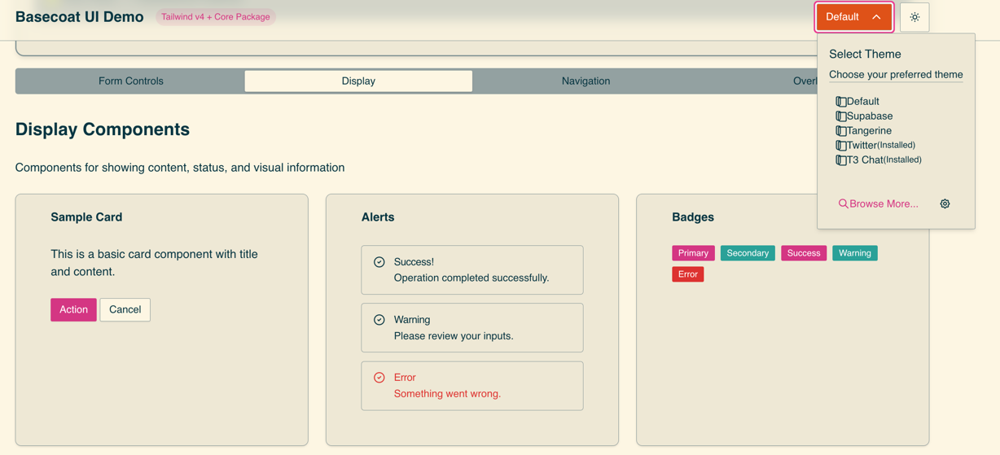
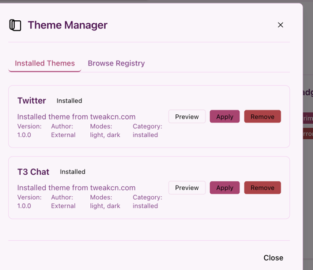
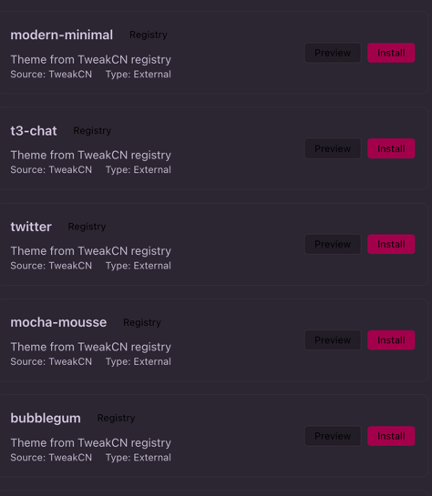

<div align="center">

# 🎨 Multi-Theme Manager

**Sistema modular de gestión de temas para aplicaciones web modernas**

## 📸 Demo Visual

<table>
<tr>
<td align="center" width="33%">
<strong>🚀 Astro Integration</strong><br/>

</td>
<td align="center" width="33%">
<strong>🎨 Installed Themes</strong><br/>

</td>
<td align="center" width="33%">
<strong>🌐 Theme Registry</strong><br/>

</td>
</tr>
</table>

[](https://www.npmjs.com/package/@mks2508/shadcn-basecoat-theme-manager)
[](https://bundlephobia.com/package/@mks2508/shadcn-basecoat-theme-manager)
[](https://www.typescriptlang.org/)
[](LICENSE)

[](https://github.com/MKS2508/themes/actions)
[]()
[]()
[]()

[](https://github.com/MKS2508/themes/stargazers)
[](https://github.com/MKS2508/themes/network/members)

[Demo](https://mks2508.github.io/themes) • [Documentación](../../wiki) • [Ejemplos](examples/) • [NPM](https://www.npmjs.com/~mks2508)

</div>

---

> [!NOTE]
> **Funcionalidad Core**: Gestión de variables CSS dinámicas, instalación de temas desde URLs, persistencia de preferencias de usuario, y compatibilidad con shadcn/ui (React) y Basecoat UI (framework-agnostic).

<details>
<summary>📝 <strong>Table of Contents</strong></summary>

- [🎨 Características](#características-principales)
- [📦 Arquitectura](#arquitectura-del-sistema)
- [🚀 Inicio Rápido](#inicio-rápido)
- [🔧 Configuración Avanzada](#configuración-de-desarrollo-monorepo)
- [🏁 Comparación](#comparación-con-alternativas)
- [⚡ Arquitectura Técnica](#arquitectura-técnica)
- [📊 Performance](#métricas-de-performance)
- [🔧 Desarrollo Local](#desarrollo-local)
- [🚀 Build y Release](#build-y-release)
- [🤝 Contribuir](#contribuir)

</details>

## 🎨 Características Principales

| Feature | Description | Performance |
|---------|-------------|-------------|
| **🎨 Temas Dinámicos** | Cambio instantáneo sin rebuild | `~12ms` |
| **📦 Multi-Framework** | React, Astro, Vanilla JS, Web Components | ✅ Universal |
| **🔗 TweakCN Integration** | Instalación directa desde URLs | ✅ One-click |
| **💾 Persistencia** | IndexedDB + localStorage | ✅ Offline-ready |
| **🔤 Font Management** | Google Fonts con override | ✅ Cached |
| **⚡ Bundle Size** | Core optimizado + tree-shakeable | `8KB - 25KB` |


## 🚀 Inicio Rápido

> [!TIP]
> Elige tu framework favorito y sigue las instrucciones específicas. Todos los packages están diseñados para funcionar de forma independiente.

<details>
<summary>🌐 <strong>Vanilla JavaScript</strong></summary>

### Instalación
```bash
npm install @mks2508/shadcn-basecoat-theme-manager @mks2508/theme-manager-vanilla
```

### Uso

```javascript
import { createThemeManager } from '@mks2508/theme-manager-vanilla';

const themeManager = createThemeManager({
  autoInit: true
});

// Montar selector de temas
themeManager.mountThemeSelector('#theme-selector');

// Uso programático
await themeManager.setTheme('supabase', 'dark');
await themeManager.installThemeFromUrl('https://tweakcn.com/r/themes/tema.json');
```

</details>

<details>
<summary>⚛️ <strong>React (Estilo shadcn/ui)</strong></summary>

### Instalación
```bash
npm install @mks2508/shadcn-basecoat-theme-manager @mks2508/theme-manager-react
```

### Uso

```jsx
import { ThemeProvider, ThemeSelector, useTheme } from '@mks2508/theme-manager-react';

// Plug & play - funciona como shadcn/ui pero con multi-tema
function App() {
  return (
    <ThemeProvider defaultTheme="supabase" defaultMode="auto">
      <ThemeSelector /> {/* Dropdown con todos los temas instalados */}
      <DashboardShadcn /> {/* Tus componentes shadcn normales */}
    </ThemeProvider>
  );
}

function MiComponente() {
  const { setTheme, installTheme, themes } = useTheme();
  
  // Instalar tema desde tweakcn dinámicamente
  const handleInstallTheme = async () => {
    await installTheme('https://tweakcn.com/r/themes/kodama-grove.json');
  };
}
```

</details>

<details>
<summary>🚀 <strong>Astro (Con @mks2508/basecoat-astro-components)</strong></summary>

### Instalación
```bash
npm install @mks2508/shadcn-basecoat-theme-manager @mks2508/theme-manager-astro @mks2508/basecoat-astro-components
```

### Uso

```astro
---
// Usa mi set personalizado de componentes Basecoat adaptados para Astro
// Basados en basecoat-css pero con mis cambios de estilos y completamente Astro-friendly
import { ThemeProvider, ThemeSelector, ThemeInstaller } from '@mks2508/theme-manager-astro';
import { Button, Card, Modal } from '@mks2508/basecoat-astro-components';
---

<ThemeProvider client:load>
  <header>
    <ThemeSelector client:visible />
    <ThemeInstaller client:visible /> {/* Modal para instalar temas de tweakcn */}
  </header>
  <main>
    <!-- Mis componentes Basecoat personalizados con multi-tema automático -->
    <Card>
      <Button variant="primary">Cambia automáticamente con cada tema</Button>
    </Card>
  </main>
</ThemeProvider>
```

> [!NOTE]
> **Crédito**: La implementación Astro está basada en [Basecoat UI](https://basecoatui.com/) con adaptaciones personalizadas en `@mks2508/basecoat-astro-components`.

</details>

<details>
<summary>🧩 <strong>Web Components</strong></summary>

### Instalación
```bash
npm install @mks2508/shadcn-basecoat-theme-manager @mks2508/theme-manager-web-components
```

### Uso

```html
<!-- Custom elements auto-registrados -->
<script type="module" src="@mks2508/theme-manager-web-components"></script>

<theme-selector></theme-selector>
<dark-mode-toggle></dark-mode-toggle>
```

</details>

<details>
<summary>⚙️ <strong>CLI de Inicialización</strong></summary>

```bash
# Instalar globalmente
npm install -g @mks2508/theme-manager-cli

# Inicializar en proyecto existente
theme-manager init astro
theme-manager init react

# Instalar tema desde URL
theme-manager install https://tweakcn.com/r/themes/tema.json
```

</details>

---

### Configuración de Desarrollo (Monorepo)


> **Documentación Técnica Completa**: Para detalles sobre project-utils, configuración de WebStorm, pipelines CI/CD, y workflows de desarrollo avanzados, consulta la [**Wiki del Proyecto**](../../wiki) en GitHub.

## 🎨 Visión General de la Arquitectura

### Sistema de Packages del Monorepo
Este proyecto utiliza una **arquitectura de monorepo NPM modular** con desarrollo basado en workspaces:

| **Package** | **Propósito** | **Dependencies** |
|-------------|---------------|------------------|
| `@mks2508/shadcn-basecoat-theme-manager` | **CORE** - Lógica de temas y fuentes (sin UI) | `@mks2508/better-logger` |
| `@mks2508/simple-html-component-template-engine` | Sistema de componentes + templates | None (standalone) |
| `@mks2508/theme-manager-vanilla` | Implementación Basecoat CSS | core + template-engine |
| `@mks2508/theme-manager-react` | Hooks React & componentes | core + React |
| `@mks2508/theme-manager-astro` | Componentes Astro | core + Astro |
| `@mks2508/theme-manager-web-components` | Custom Elements | core |
| `@mks2508/theme-manager-cli` | CLI de automatización | core + commander |

### Características Core
- **Carga Dinámica de Temas**: Archivos CSS cargados bajo demanda con tracking de rendimiento
- **Packages Modulares**: Packages NPM independientes con APIs limpias
- **Múltiples Implementaciones**: Vanilla JS, React, Astro, Web Components
- **Debugging Remoto**: Streaming de logs del navegador al terminal vía WebSocket
- **Logging Avanzado**: @mks2508/better-logger con salida categorizada y estilizada
- **Desarrollo en Workspace**: Enlazado automático de packages y resolución de dependencias

### Temas Disponibles

| Tema | Descripción | Características |
|------|-------------|----------------|
| **Default** | Tema limpio del sistema | Fuentes del sistema, diseño minimalista |
| **Supabase** | Tema inspirado en la marca | Fuente Outfit, acentos verdes |
| **Tangerine** | Tema cálido | Inter + JetBrains Mono, tonos naranjas |
| **Custom** | Instalación desde URLs | Compatible con TweakCN |

### Instalación de Temas Personalizados

#### 1. **Via CLI**:
```bash
npm run install-theme https://tweakcn.com/r/themes/[nombre-tema].json
```

#### 2. **Via interfaz web**: 
- Abrir navegador → Dropdown de temas → "Browse themes"
- Pegar URL del tema → Preview → Instalar

#### 3. **Via CLI de inicialización**:

```bash
# Instalar tema via CLI
npm run install-theme https://tweakcn.com/r/themes/kodama-grove.json

```

## 🏁 Comparación con Alternativas

<div align="center">

| Solución | Temas Dinámicos | Frameworks | Instalación Runtime | Setup |
|:--------:|:---------------:|:----------:|:-------------------:|:-----:|
| **Multi-Theme Manager** | ✅ **Dinámico** | React, Astro, Vanilla, WC | ✅ **URLs tweakcn** | **CLI** |
| shadcn/ui | ❌ 1 por build | Solo React | ❌ Manual | Manual |
| Basecoat UI | ❌ 1 por build | Multi-framework | ❌ No soportado | Manual |
| DaisyUI | ✅ CSS-based | Multi-framework | ❌ Predefinidos | Manual |
| NextUI | ✅ Light/Dark | Solo React | ❌ Predefinidos | Manual |

</div>

## ⚡ Arquitectura Técnica

### Sistema de Variables CSS Dinámicas
```css
/* Arquitectura basada en data attributes */
[data-theme="supabase"] {
  --color-primary: #10b981;
  --color-secondary: #1f2937;
  /* Variables CSS inyectadas dinámicamente */
}

[data-theme="tangerine"] {
  --color-primary: #f97316;
  --color-secondary: #0f172a;
}
```

### Flujo de Instalación de Temas
```bash
# Instalación desde TweakCN
npx @mks2508/theme-manager-cli install-theme https://tweakcn.com/r/themes/kodama-grove.json

# Pipeline automático:
# 1. Fetch y parsing de configuración JSON
# 2. Generación de CSS variables
# 3. Registro en ThemeManager
# 4. Persistencia en IndexedDB
```

### Storage y Persistencia
- **IndexedDB**: Temas instalados, metadatos, configuraciones
- **localStorage**: Tema activo, preferencias de fuente
- **CSS injection**: Variables aplicadas directamente a `:root`

### 📊 Métricas de Performance

<div align="center">

| Métrica | Valor | Estado |
|:--------|:-----:|:------:|
| **Theme Switching** | `~12ms` | ✅ **Excelente** |
| **Theme Installation** | `~200ms` | ✅ **Rápido** |
| **Bundle Size (Core)** | `8KB` | ✅ **Ligero** |
| **Bundle Size (Frameworks)** | `15-25KB` | ✅ **Optimizado** |
| **Tree Shakeable** | `100%` | ✅ **Completo** |

</div>

## 🔧 Desarrollo Local

> [!IMPORTANT]
> Para configuración completa del entorno de desarrollo, debugging remoto y project-utils, consulta la [**guía detallada**](../../wiki/Local-Development).

<details>
<summary>🛠️ <strong>Configuración Básica</strong></summary>

```bash
# Instalar dependencias y configurar workspaces
pnpm install

# Desarrollo estándar
npm run dev
```

</details>

<details>
<summary>🔍 <strong>Debugging Remoto (Opcional)</strong></summary>

Sistema WebSocket para ver logs del navegador en terminal:

```bash
# Terminal 1: WebSocket logger
npm run dev:logger

# Terminal 2: Desarrollo
npm run dev

# Logs aparecen en Terminal 1:
# 18:13:26 [LOG] 🎨 Theme switch: supabase (12.1ms)
```

</details>

## 🚀 Build y Release

<details>
<summary>📦 <strong>Build de Packages</strong></summary>

```bash
# Build todos los packages NPM
pnpm run build:packages

# TypeCheck todos los packages
pnpm run type-check:all

# Build aplicación demo
npm run build
```

</details>

<details>
<summary>💰 <strong>Release</strong></summary>

```bash
npm run release:patch      # Patch version
npm run release:minor      # Minor version  
npm run release:major      # Major version
```

</details>

## 🔍 Stack Tecnológico

<div align="center">

| Categoría | Tecnologías |
|:----------|:-------------|
| **🎨 Core** | [Tailwind CSS v4](https://tailwindcss.com/docs) • [Basecoat UI](https://basecoat.design) • [TypeScript](https://www.typescriptlang.org) • [Vite](https://vitejs.dev) |
| **🔧 Tools** | [@mks2508/better-logger](https://www.npmjs.com/package/@mks2508/better-logger) • WebSocket debugging • IndexedDB |
| **📚 Docs** | [Wiki del Proyecto](../../wiki) • [Contribución](../../wiki/Contributing) • [Setup Local](../../wiki/Local-Development) |

</div>

## 🤝 Contribuir

<div align="center">

🚀 **El proyecto está en desarrollo activo** 🚀

[](https://github.com/MKS2508/themes/graphs/contributors)
[](../../pulls)

</div>

> [!TIP]
> Para guía completa de contribución, setup de desarrollo y standards de código, consulta la [**guía detallada**](../../wiki/Contributing).

<details>
<summary>📝 <strong>Quick Start para Contributors</strong></summary>

1. **Fork del repositorio**
2. **Branch para tu feature**: `git checkout -b feature/mejora-tema`
3. **Commit**: `npm run commit:ui` (interfaz interactiva)
4. **Push y PR**

**🎯 Áreas prioritarias**: Testing suite, adaptadores de frameworks (Vue/Svelte), optimizaciones de performance.

</details>

<div align="center">

---

## 📄 Licencia

[](LICENSE)

**MIT License** - Libre para uso comercial y personal

---

## 👤 Autor

**Desarrollado con ❤️ por [MKS2508](https://github.com/MKS2508)**

[](https://github.com/MKS2508)
[](https://www.npmjs.com/~mks2508)

---

## 🎆 Inspirado Por

| Proyecto | Contribución |
|:---------|:-------------|
| [**Basecoat UI**](https://basecoatui.com/) | Filosofía de componentes sin React |
| [**tweakcn.com**](https://tweakcn.com) | Ecosystem de temas para shadcn |
| [**shadcn/ui**](https://ui.shadcn.com/) | La forma correcta de hacer component libraries |

<sub>Made with ❤️ and a lot of ☕ by the open source community</sub>

</div>